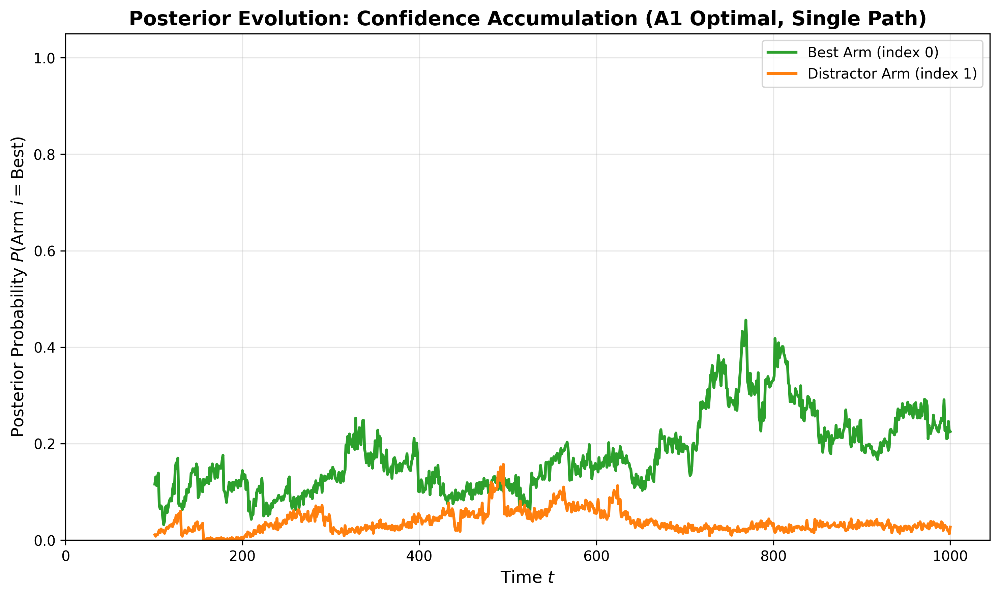

## Shortlist Experiments



Minimal setup to reproduce the A1 shortlist sampling simulations described in `design.md` and the experimental plan in `detailed_exp_plan.md`.

## Quick Start

**Default workflow** (simulation + automatic analysis):
```bash
# Quick test with reduced parameters (modify DEFAULT_CONFIG in the file)
python run_experiment.py

# Or override via command-line
python run_experiment.py --replications 10 --budget 200

# Full experiment per detailed_exp_plan.md
python run_experiment.py --replications 1000 --budget 1000
```
By default, `run_experiment.py` automatically runs analysis and generates plots after the simulation completes.

**Two-step workflow** (useful for long-running simulations):
1. **Run simulation only** (saves data to `data/` folder):
```bash
python run_experiment.py --simulate-only --replications 1000
```

2. **Analyze results and generate plots** (reads from `data/` folder):
```bash
python analyze_results.py
```

The new script (`run_experiment.py`) implements the full experimental plan with 6 policies, time-series logging, and CSV/JSON output files. Simulation data is saved to the `data/` folder, and `analyze_results.py` can regenerate plots from saved data at any time.

## Code Structure

- **`algorithms.py`**: Core algorithm implementations (extracted for reuse)
  - Uniform Allocation
  - Thompson Sampling
  - A1 Sampling
  - Top-Two Thompson Sampling (TopTwoTS)
  - Helper functions for posterior computation and shortlist selection

- **`run_a1_simulation.py`**: ~~Original simulation script~~ **DEPRECATED**
  - Compares 3 policies: Uniform, Thompson Sampling, A1
  - Interactive output with statistical tests
  - **Note:** This script is deprecated. Use `run_experiment.py` instead.

- **`run_experiment.py`**: Simulation script (per `detailed_exp_plan.md`)
  - Runs 6 policies: Uniform, TS, A1 (Standard), A1 (SqrtK), TopTwoTS (Standard), TopTwoTS (SqrtK)
  - Uses "hard" instance: (1, 0.9, ..., 0.9, 0, ..., 0)
  - Collects time-series data for learning curves
  - Saves data to `data/` folder: `config.json`, `results_summary.csv`, `trajectory_data.json`, `allocation_data.csv`
  - Use `--simulate-only` flag to skip plotting
  - Easy parameter modification via `DEFAULT_CONFIG` at top of file

- **`analyze_results.py`**: Analysis and plotting script
  - Reads simulation data from `data/` folder
  - Generates all plots and summaries
  - Can regenerate plots without re-running simulation
  - Figure 1: Learning curves for all 6 policies
  - Figure 2: Sample distribution by arm group (all 6 policies) with arm index clarifications
  - Figure 3: Posterior evolution for A1 (SqrtK), Thompson Sampling, and TopTwoTS (SqrtK) with arm index clarifications

## Implementation Summary

The experiment script (`run_experiment.py`) instantiates a Gaussian multi-armed bandit with a warm-start prior, then:
- update posterior means/variances per pull using the uninformative-prior formulas from `design.md`
- simulate allocation rules (uniform, Thompson sampling, A1, TopTwoTS)
- repeat each policy for the requested number of replications
- count how often the final shortlist (top posterior means) contains the true best arm

The objective is to compare shortlist success probabilities under identical budgets and noise assumptions.

## Simulation Setup

- **Reward model:** Each arm emits rewards from `N(theta_i, σ²)` with a shared known variance (`--sigma-sq`).
- **Warm start:** Every policy begins by pulling each arm once (`k` pulls) to initialize posterior counts/sums.
- **Posterior tracking:** Means `μ_i = S_i / N_i`, variances `σ_i² = σ² / N_i`; no priors beyond the warm start.
- **Policies evaluated:**
  - `Uniform Allocation`: random arm each step.
  - `Thompson Sampling`: sample once per arm per step, pull argmax.
  - `A1 Sampling`: Algorithm 1 from `design.md`, β vector with `β₁ = --beta-top`, all others zero.
- **Budget:** `--budget` counts total pulls including the warm start; remaining budget is spent following the policy.
- **Replications:** Repeat the entire run `--replications` times; each replication regenerates the warm start.
- **Success metric:** After budget exhaustion, select shortlist of size `m` via highest posterior means and check if it contains the true best arm.

## Script-Specific Details

### `run_a1_simulation.py` (DEPRECATED)
- **Status:** Deprecated - use `run_experiment.py` instead
- **Policies:** Uniform, Thompson Sampling, A1 Sampling
- **Default parameters:** `k=10`, `m=3`, `budget=100`
- **True means:** Defaults to example from `design.md`; pass `--true-means` to override
- **Output:** Console output with success rates and statistical tests

### `run_experiment.py` (Recommended)
- **Policies:** Uniform, TS, A1 (Standard), A1 (SqrtK), TopTwoTS (Standard), TopTwoTS (SqrtK)
- **Default parameters:** `k=100`, `m=10`, `budget=1000`, `replications=1000` (modify `DEFAULT_CONFIG` for quick testing)
- **Instance:** Hard instance `(1, 0.9, ..., 0.9, 0, ..., 0)` per `detailed_exp_plan.md`
- **Output files** (saved to `data/` folder):
  - `config.json`: Experiment configuration and parameters
  - `results_summary.csv`: Final success rates and regret for all policies
  - `trajectory_data.json`: Time-series data for learning curves
  - `allocation_data.csv`: Pull counts per arm group (best, distractors, noise)
- **Flags:**
  - `--simulate-only`: Run simulation only, skip plot generation
  - `--data-dir`: Specify data directory (default: `data/`)
- **Quick testing:** Edit `DEFAULT_CONFIG` dictionary at top of file to reduce `replications`/`budget` for faster runs

### `analyze_results.py`
- **Input:** Reads data from `data/` folder (generated by `run_experiment.py`)
- **Output:** Generates plots in current directory (or `--output-dir`):
  - `figure1_learning_curve.png`: Success probability over time for all 6 policies
  - `figure2_allocation_efficiency.png`: Sample distribution by arm group (all 6 policies) with arm index ranges in legend
  - `figure3_posterior_evolution.png`: Posterior probability evolution comparing A1 (SqrtK), Thompson Sampling, and TopTwoTS (SqrtK) with arm indices in legend
- **Flags:**
  - `--data-dir`: Specify data directory (default: `data/`)
  - `--output-dir`: Specify output directory for plots (default: current directory)

## Defaults

**`run_experiment.py` (Recommended):**
- Arms `k=100`, shortlist size `m=10`, budget `1000`
- Reward variance `σ²=1.0`
- Replications `1000` (reduce in `DEFAULT_CONFIG` for quick testing)
- Hard instance with difficulty parameter `x=0.9`

See `design.md` for the theoretical motivation and `detailed_exp_plan.md` for the full experimental plan.

